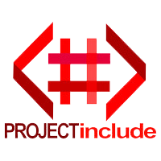

# Project Include Site 2021

Created by: [Shabaz Badshah](https://github.com/ShabazBadshah/)
Maintained by: [Shabaz Badshah](https://github.com/ShabazBadshah/)

## Site Goals

This is the official Project Include (PI) site for 2021 (redesigned with [NextJS](https://nextjs.org/) which focuses on the following four objectives:

1. To provide boost credibility, increase stakeholder/partner interest, and increase brand presence
2. To provide a modern UX/UI experience to visitors
3. Introduce a component-based frontend to allow for easier maintability and scalability by migrating to React
4. Additional performance improvements to run on lower end hardware

This site is an enhancement of the existing [PI site](https://projectinclude.ca). See [jekyll-site-v2 source code](https://github.com/Project-Include/Project-Include.github.io/tree/jekyll-site-v2) for the previous iteration of the site

## System Preparation

To use this starter project, you'll need the following things installed on your machine.

1. [NodeJS](http://nodejs.org) - use the installer.
2. [Yarn](https://yarnpkg.com/) - `$ npm install -g yarn`

## Local Install

1. Open a shell and clone repo via ```git clone https://github.com/ShabazBadshah/project-include-site.git```
2. Change directories to where the repo has been cloned via ```cd /path/to/repo```. This will be your current working directory (CWD).
3. Run ```yarn install``` in the CWD. This will install all project dependencies
4. Run ```yarn start``` in the CWD. This will start the NextJS app

## Attributions

Project structure based on work from [João Pedro Schmitz](https://github.com/jpedroschmitz/typescript-nextjs-starter)